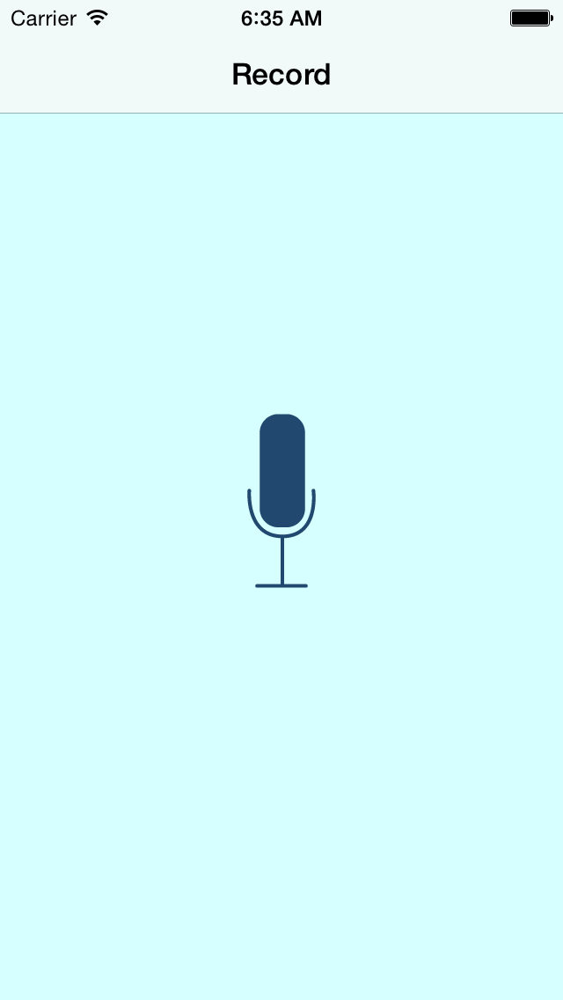
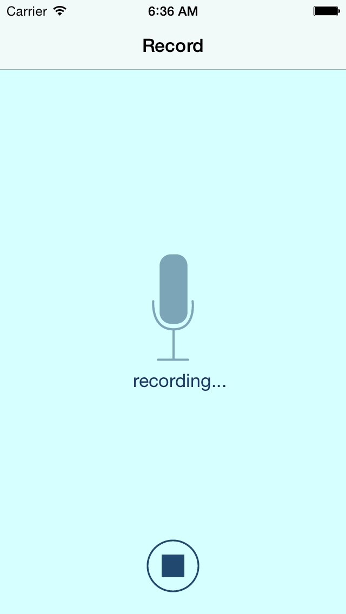
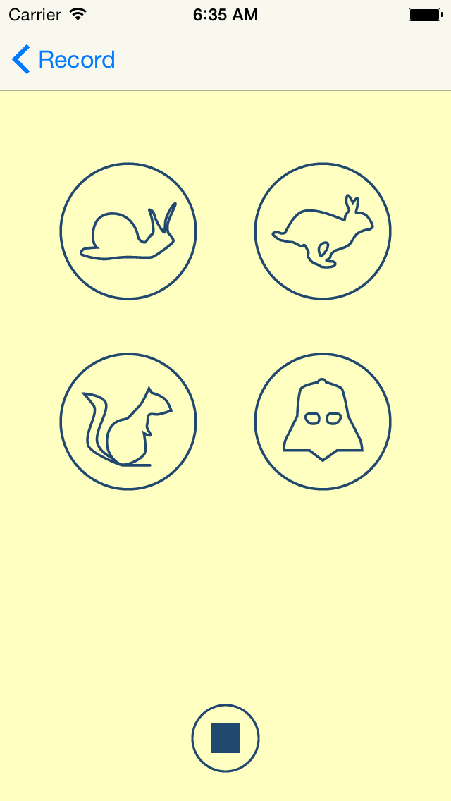

# Pitch-Perfect
An iOS app for adding voice effects to recorded audio. Built in Swift.

Built as a part of Udacity's Swift tutorial.

It is intended to be opened as an XCode project.

P.S. Try the Darth Vader filter and say, "Luke, I am your father"!

ScreenShots:
=============

 "Initial Screen"

 "Recording"

 "Adding Voice effects"